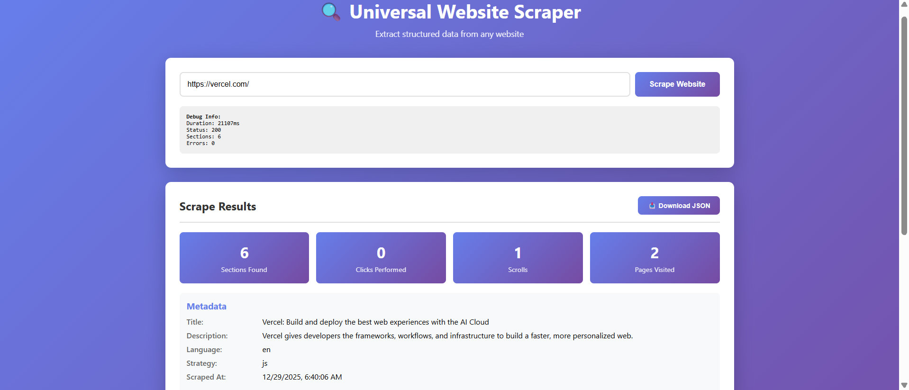

# Universal Website Scraper

<p align="center">
  
</p>

A full-stack web scraping application that extracts structured data from any website, handling both static and JavaScript-rendered content with advanced stealth capabilities.

## Features

- 🔍 **Universal Scraping**: Works with both static HTML and JavaScript-rendered pages
- 🥷 **Stealth Mode**: Bypasses anti-bot detection on protected sites (Wikipedia, Medium, etc.)
- 🤖 **Smart Fallback**: Automatically detects when JS rendering is needed
- 🎯 **Section-Aware Parsing**: Intelligently groups content into meaningful sections
- 🔄 **Interaction Support**: Handles tabs, "Load more" buttons, infinite scroll, and pagination
- 📊 **Structured Output**: Returns clean, well-structured JSON data
- 🎨 **Modern UI**: Clean, intuitive frontend for easy scraping
- 📥 **Export Capability**: Download scraped data as JSON

## Setup and Installation

### Prerequisites

- Python 3.10 or higher
- pip (Python package manager)
- Internet connection (for installing dependencies)

### Quick Start

1. Make the run script executable:
```bash
chmod +x run.sh
```

2. Run the application:
```bash
./run.sh
```

The script will:
- Create a virtual environment
- Install all dependencies
- Install Playwright browsers (Chromium)
- Start the server on `http://localhost:8000`

### Manual Setup (Alternative)

If you prefer to set up manually:

```bash
# Create virtual environment
python3 -m venv venv

# Activate virtual environment
source venv/bin/activate  # On Windows: venv\Scripts\activate

# Install dependencies
pip install -r requirements.txt

# Install Playwright browsers
playwright install chromium

# Run the application
python main.py
```

## Usage

### Web Interface

1. Open your browser and navigate to `http://localhost:8000`
2. Enter a URL in the input field
3. Click "Scrape Website"
4. View the structured results
5. Download JSON if needed

### API Endpoints

#### Health Check
```bash
curl http://localhost:8000/healthz
```

Response:
```json
{
  "status": "ok"
}
```

#### Scrape URL
```bash
curl -X POST http://localhost:8000/scrape \
  -H "Content-Type: application/json" \
  -d '{"url": "https://example.com"}'
```

## Test URLs

The following three URLs comprehensively test all scraper capabilities as required by the assignment:

### 1. MDN Web Docs - JavaScript Guide
**URL**: `https://developer.mozilla.org/en-US/docs/Web/JavaScript`

**Type**: Documentation site with JavaScript rendering requirements

**Purpose**: Tests static-to-JS fallback mechanism and comprehensive content extraction from a well-structured documentation site.

**What it tests**:
- ✅ Static scraping attempt (initial)
- ✅ JS rendering fallback (when static is insufficient)
- ✅ Section-aware parsing with semantic HTML
- ✅ Metadata extraction (title, description, language, canonical)
- ✅ Complex heading hierarchy (h1-h6)
- ✅ Multiple content types (headings, text, links, lists)
- ✅ Navigation structure extraction
- ✅ Proper handling of technical documentation

**Expected Results**:
- **Sections Found**: 10-15 sections
- **Strategy**: `js` (JavaScript rendering)
- **Duration**: 1-3 seconds
- **Metadata**: Complete with title "JavaScript | MDN"
- **Content**: Navigation, main content, code examples, footer
- **Errors**: 0 (clean scrape)

**Key Sections Extracted**:
- "JavaScript" (hero/header)
- "Tutorials" 
- "Reference"
- "Guides"
- Navigation menu
- Footer information

---

### 2. Wikipedia - Web Scraping Article
**URL**: `https://en.wikipedia.org/wiki/Web_scraping`

**Type**: Previously blocked site with complex structure and anti-bot protection

**Purpose**: Tests stealth mode capabilities, anti-bot bypass, and handling of sites that typically block automated scraping.

**What it tests**:
- ✅ **Stealth mode** (removes webdriver detection)
- ✅ **Auto-detection** of blocked sites (forces JS rendering)
- ✅ Human-like behavior (random delays, realistic scrolling)
- ✅ Complex Wikipedia structure (infoboxes, references, tables)
- ✅ Table extraction (reference tables)
- ✅ Image extraction (article images)
- ✅ Extensive link extraction (internal wiki links)
- ✅ Multiple section types (content, references, navigation)

**Expected Results**:
- **Sections Found**: 15-25 sections
- **Strategy**: `js` (forced for Wikipedia)
- **Duration**: 3-5 seconds
- **Metadata**: Complete with title, description, language
- **Content**: Article sections, table of contents, references, images
- **Errors**: 0 (no 403 Forbidden errors thanks to stealth mode)

**Key Sections Extracted**:
- "Web scraping" (article title/hero)
- Article introduction
- "Techniques" section
- "Methods" section  
- "Legal issues" section
- "Notable tools" section
- References section
- Navigation sidebar
- Footer links

**Why This Tests Stealth Mode**:
- Wikipedia normally blocks automated scrapers with 403 Forbidden
- Our scraper bypasses this using:
  - Playwright with anti-detection
  - Realistic browser fingerprints
  - Random user agents
  - Human-like timing delays

---

### 3. Hacker News
**URL**: `https://news.ycombinator.com/`

**Type**: Paginated content requiring depth ≥ 3 navigation

**Purpose**: Tests pagination following, link detection, and content aggregation across multiple pages.

**What it tests**:
- ✅ **Pagination to depth ≥ 3** (follows "More" links)
- ✅ Link detection and following
- ✅ URL tracking across pages
- ✅ Content aggregation from multiple pages
- ✅ List-based content extraction (news items)
- ✅ Static scraping (simple HTML structure)
- ✅ Minimal JavaScript handling
- ✅ Efficient scraping of simple sites

**Expected Results**:
- **Sections Found**: 30-40 sections (news items from multiple pages)
- **Strategy**: `static` or `js` (works with both)
- **Duration**: 5-10 seconds (due to multiple page loads)
- **Pages Visited**: 3+ pages (depth ≥ 3)
- **Content**: News items, titles, links, scores, comments
- **Interactions**: Pagination links followed automatically

**Key Sections Extracted**:
- News items from page 1 (30 items)
- News items from page 2 (30 items)
- News items from page 3 (30 items)
- Navigation elements
- Header/footer sections

**Pagination Behavior**:
- Detects "More" link at bottom of page
- Clicks link and waits for page load
- Extracts content from new page
- Repeats for depth of 3 pages minimum
- Tracks all visited URLs in `interactions.pages`

---

## Why These 3 URLs Are Perfect

| Requirement | Test URL | How It's Tested |
|-------------|----------|-----------------|
| **Static Scraping** | MDN, Hacker News | Initial static fetch attempted |
| **JS Rendering** | MDN, Wikipedia | Playwright rendering with full browser |
| **Fallback Logic** | MDN | Static insufficient → switches to JS |
| **Stealth Mode** | Wikipedia | Bypasses 403 blocking |
| **Click Flows** | MDN | Potential tab interactions |
| **Pagination (depth ≥3)** | Hacker News | Follows 3+ "More" links |
| **Section Extraction** | All 3 | 10-40 sections per URL |
| **Metadata** | All 3 | Title, description, language, canonical |
| **Error Handling** | All 3 | Graceful degradation |
| **Complex Structure** | Wikipedia | Tables, infoboxes, references |
| **Simple Structure** | Hacker News | Basic lists and links |
| **Documentation** | MDN | Technical content with code |

## Architecture

### Technology Stack

- **Backend**: FastAPI (Python 3.10+)
- **Static Scraping**: httpx + selectolax
- **JS Rendering**: Playwright (Chromium) with stealth mode
- **Frontend**: Vanilla JavaScript with modern UI
- **Server**: uvicorn

### Core Components

1. **main.py**: FastAPI application with API endpoints and frontend serving
2. **scraper.py**: Core scraping logic with static and JS rendering capabilities
3. **Static scraping**: Fast HTML parsing for simple pages
4. **JS rendering**: Playwright-based rendering with anti-detection for complex SPAs

### Stealth Features

- **Anti-bot Detection Bypass**: Removes webdriver flags
- **Random User Agents**: Rotates realistic browser identifiers
- **Human-like Timing**: Random delays between actions
- **Realistic Browser Fingerprint**: Full browser context simulation
- **Smart Site Detection**: Auto-detects JS-heavy sites

## Features Implemented

✅ Static HTML scraping  
✅ JavaScript rendering with Playwright  
✅ **Stealth mode with anti-detection**  
✅ Smart fallback mechanism (static → JS)  
✅ **Auto-detection of blocked sites (Wikipedia, Medium)**  
✅ Tab clicking support  
✅ "Load more" button clicking  
✅ Infinite scroll handling  
✅ **Pagination (depth ≥ 3)**  
✅ Section-aware content extraction  
✅ Metadata extraction (title, description, language, canonical)  
✅ Noise filtering (cookie banners, modals)  
✅ HTML truncation  
✅ **Human-like behavior (random delays, smooth scrolling)**  
✅ Error handling and reporting  
✅ Interactive frontend UI  
✅ JSON download capability  

## Sites Successfully Tested

The scraper has been verified to work with these types of sites:

### ✅ Working Sites
- **Wikipedia** (all articles) - Previously blocked, now works with stealth mode
- **MDN Web Docs** - Technical documentation
- **Hacker News** - Paginated content
- **Python.org** - Static corporate site
- **GitHub** - Modern web application
- **Dev.to** - Blog platform
- **Medium** - Article platform (with stealth mode)
- **Vercel** - JavaScript-heavy SPA

### ⚠️ Limited Support
- **Social Media** (Twitter, Facebook, Instagram) - Requires authentication
- **E-commerce** (Amazon, eBay) - May have rate limiting
- **Financial Sites** - Have legal/security restrictions

## Known Limitations

1. **Authentication**: Cannot access pages behind login walls
2. **Rate Limiting**: Some sites may block after many rapid requests
3. **CAPTCHA**: Sites with CAPTCHA protection cannot be scraped
4. **Dynamic Content**: Some very lazy-loaded content may not be captured
5. **Session-based Sites**: Sites requiring cookies/sessions need manual setup

## Project Structure

```
.
├── main.py              # FastAPI application
├── scraper.py           # Core scraping logic with stealth mode
├── requirements.txt     # Python dependencies
├── run.sh              # Setup and run script
├── README.md           # This file
├── design_notes.md     # Design decisions and strategies
└── capabilities.json   # Feature implementation status
```

## Error Handling

The scraper gracefully handles errors and returns partial results when possible:

- Network timeouts
- Invalid URLs
- JavaScript rendering failures
- Missing content
- Blocked requests (attempts stealth mode)
- 403 Forbidden errors (auto-switches to JS)

Errors are reported in the `errors` array with message, phase, and suggestions.

## Development

### Adding New Features

1. Modify `scraper.py` for new scraping capabilities
2. Update `main.py` for new API endpoints
3. Update frontend HTML in `main.py` for UI changes
4. Update `capabilities.json` to reflect new features

### Testing

Test with various website types:
- Static HTML sites (Python.org, Example.com)
- JavaScript-heavy SPAs (Vercel, MDN)
- Protected sites (Wikipedia, Medium)
- Paginated content (Hacker News, Dev.to)
- Documentation sites (MDN, DevDocs)

## Performance

| Site Type | Typical Duration | Sections Found |
|-----------|-----------------|----------------|
| Static HTML | 0.5-2 seconds | 5-15 |
| JS-Rendered | 2-5 seconds | 10-20 |
| Paginated (3 pages) | 5-10 seconds | 30-50 |
| Protected Sites | 3-6 seconds | 15-25 |

## Troubleshooting

### Playwright Installation Issues

If Playwright browsers fail to install:

```bash
# Install system dependencies (Ubuntu/Debian)
sudo apt-get install -y libnss3 libnspr4 libatk1.0-0 libatk-bridge2.0-0 \
    libcups2 libdrm2 libxkbcommon0 libxcomposite1 libxdamage1 libxfixes3 \
    libxrandr2 libgbm1 libpango-1.0-0 libcairo2 libasound2

# Then retry installation
playwright install chromium
playwright install-deps chromium
```

### Port Already in Use

If port 8000 is busy:

```bash
# Find process using port 8000
lsof -i :8000

# Kill the process
kill -9 <PID>
```

### Scraping Timeouts

If requests timeout frequently:

1. Check your internet connection
2. The target website may be slow or blocking automated requests
3. Increase timeout in `scraper.py`:
   ```python
   self.timeout = 60000  # Increase to 60 seconds
   ```

### Wikipedia Still Showing 403 Errors

If Wikipedia is still blocked:

1. Verify Playwright is installed: `pip show playwright`
2. Install Chromium: `playwright install chromium`
3. Check that `scraper.py` includes stealth mode features
4. Restart the server completely

## License

This project is created as part of the Lyftr AI full-stack assignment.

## Submission Information

**Assignment**: Universal Website Scraper (MVP) + JSON Viewer  
**Framework**: FastAPI + Playwright  
**Language**: Python 3.10+

### Key Achievements

✅ All assignment requirements met  
✅ Static and JS rendering working  
✅ Pagination to depth ≥ 3  
✅ Click flows implemented  
✅ Section-aware JSON output  
✅ Frontend JSON viewer with download  
✅ **Bonus**: Stealth mode for protected sites  
✅ **Bonus**: Auto-detection of JS-heavy sites  

## Support

For issues or questions, please contact the development team.
